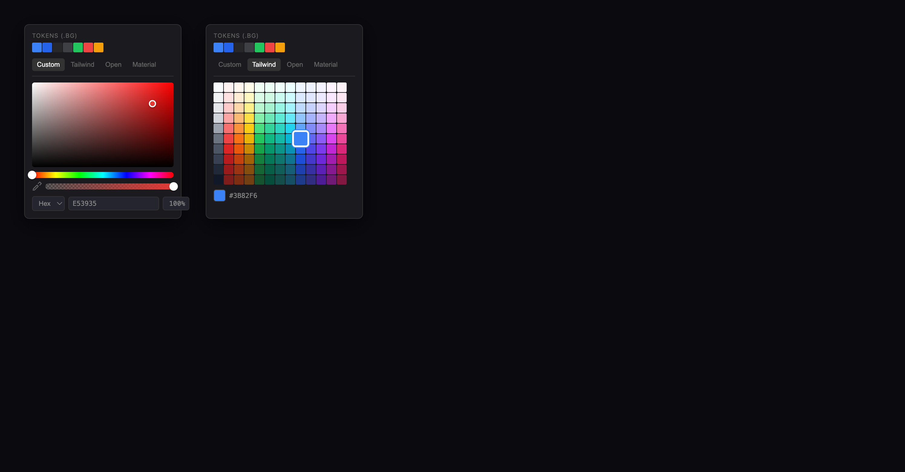

# Color Picker

## Übersicht

Erweiterung des bestehenden Color Pickers um Token-Integration, Custom-Picker (Figma-Style) und zusätzliche Farbpaletten.



## Feature-Status

| Feature | Status | Beschreibung |
|---------|--------|--------------|
| Token-Farben oben | ⬜ Offen | Zeigt passende Tokens je nach Property-Typ |
| Tabs | ⬜ Offen | Custom, Tailwind, Open Color, Material |
| Custom Tab | ⬜ Offen | Figma-Style Picker mit Farbfläche |
| Tailwind Tab | ⬜ Offen | Tailwind CSS Farbpalette |
| Open Color Tab | ✅ Besteht | Aktueller Color Picker |
| Material Tab | ⬜ Offen | Material Design Colors |
| Eyedropper | ⬜ Offen | Farbe aus Canvas aufnehmen |
| Alpha/Opacity | ⬜ Offen | Transparenz-Slider |

## UI Struktur

```
┌─────────────────────────────────────┐
│  TOKENS (.BG)                       │  ← Label zeigt Property-Typ
│  ■ ■ ■ ■ ■ ■ ■                      │  ← Passende Token-Farben (16x16px)
│                                     │
│  Custom | Tailwind | Open | Material│  ← Tabs
├─────────────────────────────────────┤
│                                     │
│  [Custom Tab: Figma-Style Picker]   │
│  oder                               │
│  [Palette Tab: Farb-Grid]           │
│                                     │
├─────────────────────────────────────┤
│  ■ #3B82F6                          │  ← Preview + Hex
└─────────────────────────────────────┘
```

## Design Spezifikation

### Container
- Background: `#1a1a1f`
- Border: `1px solid #333`
- Border-radius: `8px`
- Padding: `12px`
- Box-shadow: `0 8px 32px rgba(0,0,0,0.5)`
- Breite: `260px`

### Swatches (Token + Palette)
- Größe: `16px × 16px`
- Gap: `1px`
- Border-radius: `2px`
- Hover: `transform: scale(1.3)`
- Selected: `transform: scale(1.4)` + `box-shadow: 0 0 0 2px #fff, 0 0 0 3px #3b82f6`

### Tabs
- Font-size: `11px`
- Padding: `4px 8px`
- Active: `background: #333`, `color: #fff`
- Inactive: `color: #666`

### Footer
- Preview: `20px × 20px`, `border-radius: 4px`
- Hex: `font-family: 'SF Mono'`, `font-size: 11px`, `color: #888`

## Bereiche

### 1. Token-Farben (oben)

Zeigt alle Tokens passend zum aktuellen Property-Typ:

| Property | Zeigt Tokens mit Suffix |
|----------|------------------------|
| `bg`, `background` | `*.bg` |
| `col`, `color` | `*.col` |
| `boc`, `border-color` | Alle Farb-Tokens |

**Verhalten:**
- Klick auf Token → fügt Token-Namen ein (z.B. `$primary.bg`)
- Hover → zeigt Token-Namen als Tooltip

### 2. Tabs

| Tab | Beschreibung |
|-----|--------------|
| **Custom** | Figma-Style Picker mit Farbfläche, Hue-Slider, Alpha-Slider |
| **Tailwind** | Tailwind CSS v3 Palette (13 Farben × 10 Stufen) |
| **Open** | Open Color Palette (bestehend, 13 Farben × 10 Stufen) |
| **Material** | Material Design Colors |

### 3. Custom Tab

```
┌─────────────────────────────┐
│                             │
│      Farbfläche             │  ← Sättigung (x) / Helligkeit (y)
│           ○                 │  ← Cursor
│                             │
├─────────────────────────────┤
│ ○ 🌈🌈🌈🌈🌈🌈🌈🌈🌈🌈🌈   │  ← Hue Slider (0-360°)
├─────────────────────────────┤
│ 🔍 ░░░░░░░░░░░░░░░░░░░░ ○  │  ← Eyedropper + Alpha Slider
├─────────────────────────────┤
│ [Hex▾] [E53935    ] [100%] │  ← Format, Wert, Opacity
└─────────────────────────────┘
```

**Elemente:**
- **Farbfläche**: 2D Canvas, Breite 100%, Höhe 140px
- **Hue Slider**: Höhe 10px, Regenbogen-Gradient
- **Eyedropper**: Icon links vom Alpha-Slider
- **Alpha Slider**: Höhe 10px, Schachbrett-Hintergrund mit Farb-Overlay
- **Format Dropdown**: Hex (default), RGB, HSL
- **Wert-Eingabe**: Monospace, direkte Hex-Eingabe
- **Opacity-Eingabe**: Prozent (0-100%)

### 4. Palette Tabs (Tailwind, Open, Material)

Zeigt Farb-Grid im bestehenden Format:
- 13 Spalten (Farben)
- 10 Zeilen (Helligkeitsstufen: 50-900)
- Swatch-Größe: 16×16px
- Gap: 1px

## Trigger

Der Color Picker öffnet wenn:
1. User `#` tippt (bestehend)
2. User auf Farb-Swatch im Property Panel klickt (neu)

## Keyboard Navigation

| Taste | Aktion |
|-------|--------|
| Pfeiltasten | Navigation durch Swatches |
| Enter | Farbe auswählen |
| Escape | Schließen ohne Änderung |
| Tab | Zwischen Tabs wechseln |

## Ausgabe

| Auswahl | Eingefügter Wert |
|---------|-----------------|
| Token | `$primary.bg` |
| Palette-Farbe | `#3B82F6` |
| Custom mit Alpha | `#3B82F680` |

## Technische Umsetzung

### Erweiterung des bestehenden Codes

Der aktuelle Color Picker in `app.js` (Zeile 2384-2571) wird erweitert:

1. **Token-Sektion hinzufügen** (oben)
2. **Tab-System einbauen**
3. **Custom Tab mit Canvas implementieren**
4. **Tailwind/Material Paletten als Daten hinzufügen**

### Neue Funktionen

```javascript
// Token-Farben extrahieren
function getTokenColorsForProperty(property) { }

// Custom Color Picker
function renderCustomPicker() { }
function handleColorAreaClick(e) { }
function handleHueSliderChange(e) { }
function handleAlphaSliderChange(e) { }

// Farbkonvertierung
function hexToHsl(hex) { }
function hslToHex(h, s, l) { }
```

### Neue Daten

```javascript
const TAILWIND_COLORS = [ ... ]
const MATERIAL_COLORS = [ ... ]
```

## Dateien

- `features/colorpicker/requirements.md` - Diese Dokumentation
- `features/colorpicker/mockup.html` - Interaktives HTML-Mockup
- `features/colorpicker/mockup.png` - Screenshot des Mockups
